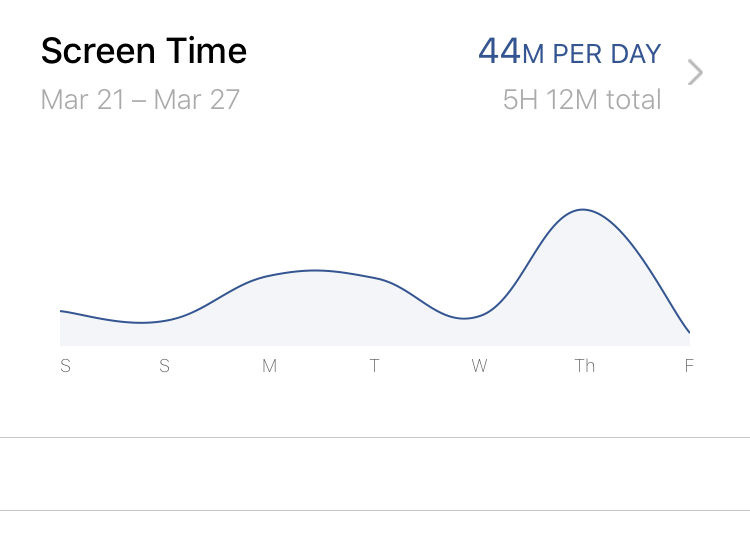

Another week done in my digital declutter experiment! This time I decided to just post a weekly update, because frankly it was taking up too much time doing the daily updates. With all of the craziness going on in the world, I wanted to prioritize spending time with my family outside of work hours, rather than on compiling statistics of my technology usage (which ironically lead to more usage).

## What went well?

This week saw a marked drop in my phone usage! 

I averaged under an hour a day, which is within my stated goal. (Keep in mind, this excludes certain apps as defined in my [Technology Usage guidelines](/techusage).) That big bump towards the end of the week is actually an error, in that Moment tracked some of the time my sleep tracking app was in use (even though it's supposed to be excluded, which I chalk up to a weird condition that hasn't happened since).

Overall, I feel more calm and collected. As I said the other day on a call, I'm noticing a big increase in my patience around my children, especially during the trying evening hours (traditionally I've always been the parent to put the kids to bed). My mind feels like it has less clutter in it, and I'm more present with the people I'm interacting with (even virtually, which given the current situation, is much more frequent).

And, as you can tell by the fact that no random odd postings hit my accounts, I've successfully weaned myself off the habit of taking my phone into the bathroom with me. I'll admit, it was painful at first, because I was so used to it as a period of escape. After a few days, the anxiety / craving subsided, and now it seems totally normal to just, well, do my business and move on.

## What could have gone better?

Despite my cellphone usage dropping to a very acceptable level, there's still a lot of room for improvement in other areas. For example, I find myself browsing non-useful sites on my computer or iPad, often looking up information around the current pandemic situation. While there's usefulness in being informed, having really paid attention to the results of this behavior over the last few days, I can only conclude that this ends up making me more anxious and miserable. After all, there's a lot of scary numbers out there right now, and I have absolutely zero ability to control them (and I think they're likely to get worse before they start getting better). As a result, I'm working through how to restrict the time I spend on this. I haven't decided on a particular strategy yet; when I do over this weekend, I'll post an update.

## What am I going to do differently next week?

First, I'm going to install the app [Freedom](https://freedom.to) on my computers (I'm not installing it on my phone since I've controlled that well enough by leaving it in a different room). I need to experiment with it more to determine if it can solve the issue I listed above (mindless browsing of news and information). 

I'm also going to introduce a new rule: my iPad remains turned off, plugged in, and in a drawer in my room, only coming out for use as a FaceTime device. No other uses allowed. *Period.* Draconian? Perhaps, but right now it's proving to be an enabler for behavior I'm trying to curb.

Onward!